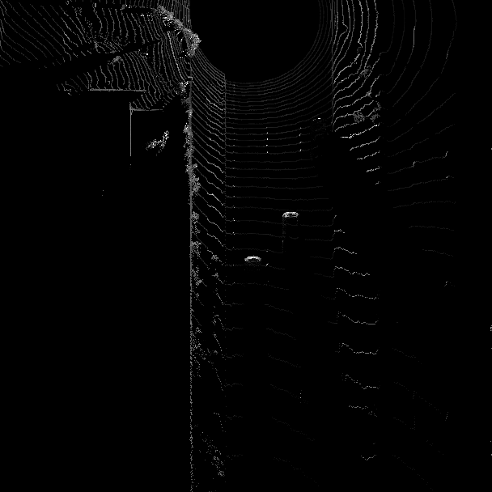

# Writeup: 3D Object Detection (Mid-Term Project)

The goal of the mid-term project was to make use of lidar measurements provided by a Velodyne laser-scanner, mounted on top of a vehicle, to detect objects in the environment the vehicle is driving in. This task was split into the following sub-tasks:

1) Computing the 3D point-cloud out of the range image provided by the laser-scanner
    - Extracting the intensity and height channel from the range image
    - Visualizing the 3D point-cloud
2) Computing the bird's eye view from the 3D point cloud
    - Converting 3D points into the bird's eye view
    - Computing the intensity layer
    - Computing the height layer
3) Object detection in the bird's eye view
    - Evaluating "FPN ResNet" for object detection
    - Extracting the bounding boxes from the model output
4) Performance evaluation of the detection algorithm
    - Computing the intersection-over-union between labels and detections
    - Computing the number of false-negatives and false-positives
    - Computing precision and recall

Below, a brief description of the different steps as well as some results can be found.

## Computing the 3D point-cloud out of the range image provided by the laser-scanner

The starting point for detecting objects in measurements created by a laser-scanner is the so called range image. It is basically a panoramic view of the scene, which encodes the intensity of the reflected light, the distance, and the elongation of a 3D point.

In this task, the range and the intensity channel of the range image had to be extracted. One very important step is to identify points without a valid reflection, those are marked with the value "-1" and have to be removed from further processing steps. Another very important step is to reduce the impact of highly reflecting objects. Those can create very high intensity values which would make the other reflections "invisible" in the intensity map as their value is too low. In the implementation, the percentiles P1 and P99 have been applied. Hence, intensity values with a value lower than P1 have been set to the P1 value. Intensity values higher than P99 have been set to the P99 value. Finally, the values had to be normalized.

Another information which can be extracted from the range image is the distance of the 3D points w.r.t. the laser-scanner. As for the intensity layer, invalid values had to be identified and removed and the remaining values had to be normalized.

Examples of the resulting intensity and range layers can be seen in Figure 1.

Figure 1: Range (top) and intensity (bottom) layer [Sequence 1, Frame 100].

The next step of the processing chain was to visualize the 3D point cloud. The points themselves were available already, the visualization had to be implemented. This was done using the Open3D toolbox.

An example of a 3D point cloud can be seen in Figure 2.

Figure 2: 3D point cloud [Sequence 1, Frame 100].

## Computing the bird's eye view from the 3D point cloud

Many object detection algorithms which rely on machine learning methods take as input the bird's eye view of the environment. This is basically a grid with cells representing a certain area of the vehicle's environment. Each cell contains the following information:
- Height of the highest 3D point falling into this cell
- Intensity of the brightest 3D point falling into this cell
- Total amount of 3D points falling into this cell

As the bird's eye view is a grid with three different values for each cell, it can be treated as an image with three channels (i.e. a RGB image).

The goal of this task was to create the intensity and height layer for each cell. For this purpose, the points of the 3D point cloud falling into each cell had to be identified and the highest point as well as the brightest point in each cell had to be determined. This information had to be stored in the respective layer of the bird's eye view. In order to get rid of extremely bright points, the P99 percentile (actually 99.5 %) has been used. This value has been used to limit the intensity values.

An example of the resulting intensity layer of the bird's eye view can be seen in Figure 3, Figure 4 shows the corresponding height layer.

Figure 3: Intensity layer of the bird's eye view [Sequence 1, Frame 100].

Figure 4: Height layer of the bird's eye view [Sequence 1, Frame 100].

## Object detection in the bird's eye view

Combining the layers mentioned above with the layer containing the information about the total amount of 3D points falling into each cell of the grid results in the final bird's eye view as shown in Figure 5. Please be aware that the bird's eye view in Figure 5 is rotated by 180 degrees compared to the individual layers shown in Figures 3 and 4.

Figure 5: Bird's eye view [Sequence 1, Frame 100].

The bird's eye view shown in Figure 5 is taken as input for the machine learning method used to detect objects in the surroundings of the vehicle. In this task, a different CNN had to be used in order to learn how to integrate different models into the detection pipeline. In particular, the "FPN ResNet" had to be integrated into the processing pipeline and the results had to be interpreted in the right way.

Figure 6 (top) shows the camera image with an overlay visualizing the labeled objects. The color of the 3D bounding boxes encodes whether a label is considered valid or not. Green bounding boxes represent valid labels, blue bounding boxes represent invalid labels. However, the reason why those labels are considered invalid is unclear. As the bird's eye view covers a longitudinal distance up to 50 m and only the three closest vehicles are visible in the bird's eye view, the assumption is that the other vehicles have a distance larger than 50 m and are not considered anymore in the Waymo Open Dataset, which is artificially limited to a detection range of 50 m.

The bottom part of Figure 6 shows the bird's eye view of the scene with the detected objects as overlay. As can be seen from the image, the detections match the present objects pretty good in this particular frame.

Figure 6: Detected objects [Sequence 1, Frame 100].

## Performance evaluation of the detection algorithm

To be able to evaluate whether a detection belongs to a labeled object or not, the criteria used is usually the intersection-over-union. In this task, the calculation of the intersection-over-union had to be implemented. Based on this information, it is possible to determine whether a detection is a true positive or not. This is the case if the intersection-over-union exceeds a certain threshold.

Additionally, two more values had to be calculated. On the one hand, the number of false-negatives, i.e. labeled objects which have not been detected by the object detection algorithm. On the other hand the false-positives, i.e. detections of the algorithm were no real object is present.

Using those numbers, two important performance metrics for object detection algorithms can be calculated: Precision and Recall.

These two metrics can be used to evaluate the performance of an object detection algorithm and to compare different algorithms against each other.

Figures 7-9 show the detection performance of the algorithm evaluated on the three sequences used in this project.

Figure 7: Detection performance for sequence 1.

Figure 8: Detection performance for sequence 2.

Figure 9: Detection performance for sequence 3.

## Examples of vehicles with different degrees of visibility

Figure 10: Vehicles with mainly the rear visible and a close vehicle with rear and side visible [Sequence 1, Frame 0].

Figure 11: Vehicles with mainly the front and side visible [Sequence 1, Frame 3].

Figure 12: Good visibility of the front and the side of the vehicle [Sequence 1, Frame 49].

Figure 13: Vehicle mainly seen from the side and one in far distance from the rear [Sequence 2, Frame 100].

Figure 14: Decreasing visibility depending on the distance of the vehicles [Sequence 3, Frame 0].

Figure 15: Decreasing visibility depending on the distance of the vehicles (vehicles passed the ego-vehicle) [Sequence 3, Frame 30].

## Examples of stable vehicle features

Based on the 3D point clouds shown in Figures 10-15 as well as the intensity layer extracted from the range image (see Figure 1, bottom), the following features appear rather stable:
- Roof of the vehicles: They can be clearly identified as they are usually the highest part of the vehicles. Hence, they stand out in the 3D point cloud.
- Window of the vehicles: The intensity of the reflected light is pretty low due to the transparency of the windows. Hence, they appear dark in the intensity layer.
- Body of the vehicles: As the body of the vehicles is usually made up of metal, it also shows a high reflectivity in the intensity layer of the range image.

Prominent features in the 3D point cloud which remain stable across different frames are shown Figure 16 and Figure 17.

Figure 16: Prominent features in the 3D point cloud [Sequence 1, Frame 49].

Figure 17: Prominent features in the 3D point cloud [Sequence 3, Frame 0].

